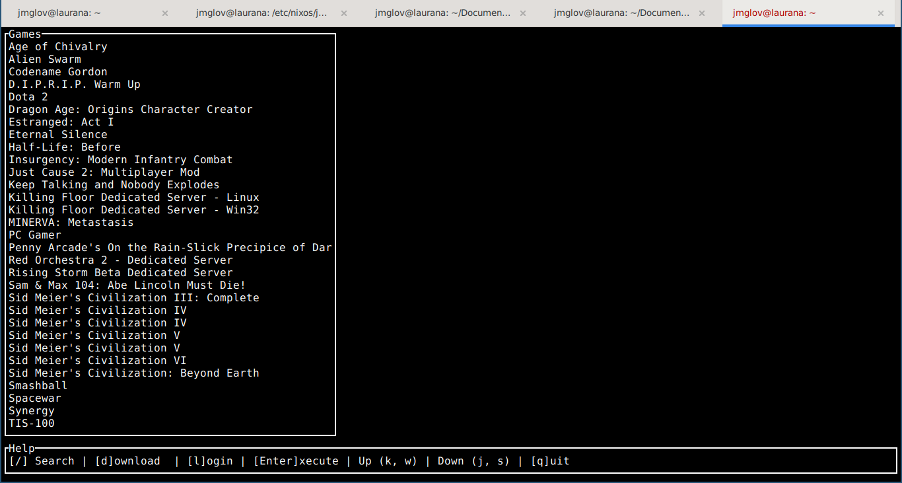

Title: Installing Steam on NixOS in 50 simple steps
Tags: 50-simple-steps,games,nix
Date: 2022-06-20

I just dropped my partner and my son off at the airport, so the dog and I are on
our own for the next 10 days. This will give me plenty of time to do some
reading (finishing up "[Foundation and
Empire](https://www.goodreads.com/book/show/29581.Foundation_and_Empire)" then
starting on a Nixon biography that my friend Simon loaded me), some writing
(part 2 of "[Story of a mediocre
fan](https://7amkickoff.com/index.php/2022/06/16/story-of-a-mediocre-fan/)" as
well as on this here blog), and some exercising (tennis, running, swimming--that
is as soon as my bloody rib stops hurting). Ah, improving the mind and body!

So naturally, as I'm eating breakfast, I get the bright idea to install Steam so
I can play some [Civ
V](https://store.steampowered.com/app/8930/Sid_Meiers_Civilization_V/). And
since I'm on NixOS, this is gonna be easy, right?

Right?

At least I had the discipline to start my blog entry **before** trying to install
Steam.

But here we go, installing Steam on NixOS in 50 simple steps!

1. See if there's already a package for Steam:
   ```
   [jmglov@laurana:~]$ nix repl '<nixpkgs>'
   Welcome to Nix 2.8.1. Type :? for help.
   
   Loading '<nixpkgs>'...
   Added 16468 variables.

   nix-repl> steam
   error: Package ‘steam’ in /nix/var/nix/profiles/per-user/root/channels/nixos/pkgs/games/steam/steam.nix:43 has an unfree license (‘unfreeRedistributable’), refusing to evaluate.
   ```
   Hell yeah! Don't worry about that unfree stuff; you've already got that
   sorted in your `home.nix`:
   ``` nix
   nixpkgs.config.allowUnfree = true;
   ```
2. Before naively adding `steam` to `home.packages`, do a little searching and
   find an [entry in the NixOS Wiki for Steam](https://nixos.wiki/wiki/Steam)!
3. Naively copy and paste the incantation from that page into `home.nix`:
   ``` nix
   programs.steam = {
     enable = true;
     remotePlay.openFirewall = true; # Open ports in the firewall for Steam Remote Play
     dedicatedServer.openFirewall = true; # Open ports in the firewall for Source Dedicated Server
   };
   ```
4. Try it out!
   ```
   [jmglov@laurana:/etc/nixos/jmglov]$ sudo nixos-rebuild switch
   building Nix...
   building the system configuration...
   error: The option `home-manager.users.jmglov.programs.steam' does not exist. Definition values:
          - In `/etc/nixos/configuration.nix':
              {
                dedicatedServer = {
                  openFirewall = true;
                };
                enable = true;
              ...
   (use '--show-trace' to show detailed location information)
   ```
   Oh you poor sweet child, thinking things would be that simple.
5. Search for "nix home-manager steam" and find a nice blog entry: "[How to
   Install Steam on
   NixOS?](https://linuxhint.com/how-to-instal-steam-on-nixos/)". Despite this
   blog entry not containing the word "home-manager" (wtf, Google? also, why
   have you not configured Firefox to use DuckDuckGo?)...
6. Get distracted by this aside and configure Firefox to use
   [DuckDuckGo](https://duckduckgo.com/) as your primary search engine to keep
   them Google cookies from leaving crumbs all over the internet.
7. Remember that oh yeah, you were reading some blog entry on installing Steam
   on Nix.
8. Despite this blog entry not containing the word "home-manager", it does make
   it obvious that `programs.steam` is a NixOS module, not a [Home
   Manager](https://nixos.wiki/wiki/Home_Manager) one. Grumble about having to
   install Steam system-wide, but then give in and move the Steam incantation to
   your `/etc/nixos/configuration.nix`, then rebuild NixOS:
   ```
   [jmglov@laurana:/etc/nixos/jmglov]$ sudo nixos-rebuild switch
   building Nix...
   building the system configuration...
   these 47 derivations will be built:
     /nix/store/0656idzgvxd6lsj5awhrami3wm66y1jk-ldconfig.drv
     /nix/store/i99alh7g9xqb0dys5w8fklld15y2jjf9-steam-wrapper.sh.drv
     /nix/store/0r8vhys80ipdspjch9l71ngddk62gws8-steam-init.drv
     /nix/store/kik59lly3njfwdqni1vnhvgk1kmnsava-steam_1.0.0.74.tar.gz.drv
     /nix/store/d9kgzf4khzvlzr1isbx49665b8xm2kma-steam-original-1.0.0.74.drv
     # ...
   ```
9. Wait for awhile for Nix to download some paths from the cache and then
   compile some C (don't worry about all those gcc warnings; real C programmers
   know what they're doing, damnit!), but then finally read these sweet sweet
   words:
   ```
   building '/nix/store/6mzdfasrx16l5zbdks6qpn98fbgyvw15-nixos-system-laurana-22.05.751.8b66e3f2ebc.drv'...
   updating GRUB 2 menu...
   stopping the following units: accounts-daemon.service, systemd-modules-load.service, systemd-udevd-control.socket, systemd-udevd-kernel.socket, systemd-udevd.service
   NOT restarting the following changed units: systemd-fsck@dev-disk-by\x2duuid-1495\x2d2D9B.service
   activating the configuration...
   setting up /etc...
   reloading user units for jmglov...
   setting up tmpfiles
   reloading the following units: dbus.service, firewall.service
   restarting the following units: polkit.service
   starting the following units: accounts-daemon.service, systemd-modules-load.service, systemd-udevd-control.socket, systemd-udevd-kernel.socket
   ```
10. Revel in the fact that you have installed some stuff, then grit your teeth
    and try to login to Steam:
    ```
    [jmglov@laurana:/etc/nixos/jmglov]$ steamcmd
    steamcmd: command not found
    ```
11. Oh ffs! Apparently you forgot to install steamcmd. OK, no matter, you can
    just add that to your `home.nix` (might as well install `steam-tui`, which
    you assume is some sort of UI?):
    ``` nix
    home.packages = with pkgs; [
      # ...
      steam-tui
      steamcmd
      # ...
    ];
    ```
12. Run `sudo nixos-rebuild switch` to apply the changes, then quickly leave the
    room so you don't have to watch gcc warnings scroll by.
13. Start a load of laundry.
14. Feel like a responsible steward of the household!
15. Remember to give the dog his arthritis medication and feel even prouder of
    yourself.
16. Become briefly overwhelmed by melancholy at the thought of your dog's
    mortality.
17. Remember that you were in the process of installing Steam on NixOS and
    liveblogging the whole thing like a boss!
18. Come back to your computer and see that not only has stuff been installed,
    but there were also no gcc warnings, so you could have just sat here and
    missed out on that whole emotional roller coaster.
19. Try `steamcmd` again:
    ```
    [jmglov@laurana:/etc/nixos/jmglov]$ steamcmd 
    bwrap: Can't chdir to /etc/nixos/jmglov: No such file or directory
    ```
    WTF? Who told you to change to that directory, `steamcmd`?
20. Have a look at the `steamcmd` script to see what in the ever-loving frack is
    going on around here:
    ``` bash
    [jmglov@laurana:/etc/nixos/jmglov]$ cat $(which steamcmd)
    #!/nix/store/40iwnlr30ykqm5ynm0bbk6bsjjc750ad-bash-5.1-p16/bin/bash -e
    
    # Always run steamcmd in the user's Steam root.
    STEAMROOT=~/.local/share/Steam
    
    # Add coreutils to PATH for mkdir, ln and cp used below
    PATH=$PATH${PATH:+:}/nix/store/2zxip96ccjx0nw24kfpjq3wl7kcx6035-coreutils-9.0/bin
    
    # Create a facsimile Steam root if it doesn't exist.
    if [ ! -e "$STEAMROOT" ]; then
      mkdir -p "$STEAMROOT"/{appcache,config,logs,Steamapps/common}
      mkdir -p ~/.steam
      ln -sf "$STEAMROOT" ~/.steam/root
      ln -sf "$STEAMROOT" ~/.steam/steam
    fi
    
    # Copy the system steamcmd install to the Steam root. If we don't do
    # this, steamcmd assumes the path to `steamcmd` is the Steam root.
    # Note that symlinks don't work here.
    if [ ! -e "$STEAMROOT/steamcmd.sh" ]; then
      mkdir -p "$STEAMROOT/linux32"
      # steamcmd.sh will replace these on first use
      cp /nix/store/4qbs47jafxn30v18kx6z8584s44g7djk-steamcmd-20180104/share/steamcmd/steamcmd.sh "$STEAMROOT/."
      cp /nix/store/4qbs47jafxn30v18kx6z8584s44g7djk-steamcmd-20180104/share/steamcmd/linux32/* "$STEAMROOT/linux32/."
    fi
    
    /nix/store/vp2njgh5r7j7vs8691bp87apii754mna-steam-run/bin/steam-run "$STEAMROOT/steamcmd.sh" "$@"
```
21. Check out `$STEAMROOT` to see what's up:
    ```
    [jmglov@laurana:/etc/nixos/jmglov]$ find ~/.local/share/Steam/
    /home/jmglov/.local/share/Steam/
    /home/jmglov/.local/share/Steam/steamcmd.sh
    /home/jmglov/.local/share/Steam/logs
    /home/jmglov/.local/share/Steam/appcache
    /home/jmglov/.local/share/Steam/linux32
    /home/jmglov/.local/share/Steam/linux32/libstdc++.so.6
    /home/jmglov/.local/share/Steam/linux32/crashhandler.so
    /home/jmglov/.local/share/Steam/linux32/steamerrorreporter
    /home/jmglov/.local/share/Steam/linux32/steamcmd
    /home/jmglov/.local/share/Steam/config
    /home/jmglov/.local/share/Steam/Steamapps
    /home/jmglov/.local/share/Steam/Steamapps/common
    ```
22. Scratch your cheek in that way people do that signifies deep puzzlement.
23. Have that "aha!" moment as you realise that obviously something weird is
    happening in that `steamcmd.sh` script and then check it out:
    ``` bash
    [jmglov@laurana:/etc/nixos/jmglov]$ cat /home/jmglov/.local/share/Steam/steamcmd.sh
    #!/nix/store/40iwnlr30ykqm5ynm0bbk6bsjjc750ad-bash-5.1-p16/bin/bash
    
    STEAMROOT="$(cd "${0%/*}" && echo $PWD)"
    STEAMCMD=`basename "$0" .sh`
    
    UNAME=`uname`
    if [ "$UNAME" == "Linux" ]; then
      STEAMEXE="${STEAMROOT}/linux32/${STEAMCMD}"
      PLATFORM="linux32"
      export LD_LIBRARY_PATH="$STEAMROOT/$PLATFORM:$LD_LIBRARY_PATH"
    else # if [ "$UNAME" == "Darwin" ]; then
      STEAMEXE="${STEAMROOT}/${STEAMCMD}"
      if [ ! -x ${STEAMEXE} ]; then
        STEAMEXE="${STEAMROOT}/Steam.AppBundle/Steam/Contents/MacOS/${STEAMCMD}"
      fi
      export DYLD_LIBRARY_PATH="$STEAMROOT:$DYLD_LIBRARY_PATH"
      export DYLD_FRAMEWORK_PATH="$STEAMROOT:$DYLD_FRAMEWORK_PATH"
    fi
    
    ulimit -n 2048
    
    MAGIC_RESTART_EXITCODE=42
    
    if [ "$DEBUGGER" == "gdb" ] || [ "$DEBUGGER" == "cgdb" ]; then
      ARGSFILE=$(mktemp $USER.steam.gdb.XXXX)
    
      # Set the LD_PRELOAD varname in the debugger, and unset the global version.
      if [ "$LD_PRELOAD" ]; then
        echo set env LD_PRELOAD=$LD_PRELOAD >> "$ARGSFILE"
        echo show env LD_PRELOAD >> "$ARGSFILE"
        unset LD_PRELOAD
      fi
    
      $DEBUGGER -x "$ARGSFILE" "$STEAMEXE" "$@"
      rm "$ARGSFILE"
    else
      $DEBUGGER "$STEAMEXE" "$@"
    fi
    
    STATUS=$?
    
    if [ $STATUS -eq $MAGIC_RESTART_EXITCODE ]; then
        exec "$0" "$@"
    fi
    exit $STATUS
    ```
24. Spend some time scratching your head, because that cheek thing apparently
    didn't cut it.
25. Have a look at `/run/current-system/sw/bin/steam-run`, then scratch your
    head some more.
26. Realise that `/etc/nixos/jmglov` is where you keep your Home Manager config,
    then guess that since you're installing Steam as an os-wide package, maybe
    you should do the same with `steamcmd` and `steam-tui`.
27. Realise that blergh! the channel being used by Home Manager is probably not
    the same one being used by NixOS.
28. Confirm this:
    ```
    [jmglov@laurana:/etc/nixos/jmglov]$ nix-channel --list
    home-manager https://github.com/nix-community/home-manager/archive/release-21.05.tar.gz
    nixos https://nixos.org/channels/nixos-21.11
    unstable https://nixos.org/channels/nixpkgs-unstable
    ```
29. Swear in whatever way you see fit.
30. Promise yourself to upgrade Home Manager to 21.11 someday (but not this
    day).
31. Move the bloody packages to bloody `/etc/nixos/configuration.nix` and `sudo
    nixos-rebuild switch` again.
32. Hold your breath and try `steamcmd` again:
    ```
    [jmglov@laurana:/etc/nixos/jmglov]$ steamcmd 
    bwrap: Can't chdir to /etc/nixos/jmglov: No such file or directory
    ```
33. Swear at greater length than you previously did.
34. Realise something about your prompt and slowly turn red with embarrassment.
35. Type a command so your readers can see why you're embarrassed if they didn't
    already catch it somewhere around step 19:
    ```
    [jmglov@laurana:/etc/nixos/jmglov]$ pwd
    /etc/nixos/jmglov
    ```
36. Change to your actual home directory obv.
37. Run `steamcmd` and watch as stuff actually happens!
    ```
    [jmglov@laurana:~]$ steamcmd 
    Redirecting stderr to '/home/jmglov/.local/share/Steam/logs/stderr.txt'
    ILocalize::AddFile() failed to load file "public/steambootstrapper_english.txt".
    [  0%] Checking for available update...
    [----] Downloading update (0 of 54,952 KB)...
    [  0%] Downloading update (642 of 54,952 KB)...
    [  1%] Downloading update (1,326 of 54,952 KB)...
    [  2%] Downloading update (2,236 of 54,952 KB)...
    ...
    [----] Installing update...
    [----] Cleaning up...
    [----] Update complete, launching Steamcmd...
    Redirecting stderr to '/home/jmglov/.local/share/Steam/logs/stderr.txt'
    [  0%] Checking for available updates...
    [----] Verifying installation...
    Steam Console Client (c) Valve Corporation - version 1654574676
    -- type 'quit' to exit --
    Loading Steam API...OK
    
    Steam>
    ```
38. Swear again, but this time in celebration of the great victory you just
    achieved!
39. Login to Steam, as soon as you remember your username and password:
    ```
    Steam>login jmglov "This is not actually a password; nice try!"
    Logging in user 'jmglov' to Steam Public...
    This computer has not been authenticated for your account using Steam Guard.
    Please check your email for the message from Steam, and enter the Steam Guard
     code from that message.
    You can also enter this code at any time using 'set_steam_guard_code'
     at the console.
    Steam Guard code:H4X0R                              
    OK
    Waiting for client config...OK
    Waiting for user info...OK
    ```
40. Get distracted by an email from your new boss whilst you're looking for your
    Steam Guard code. Reply, because that's your boss writing!
41. According to the [NixOS Wiki article](https://nixos.wiki/wiki/Steam),
    `steam-tui` "should start just fine" after logging into Steam using
    `steamcmd`, so give it a whirl!
42. Realise that `steam-tui` obviously stands for Steam Terminal User Interface,
    and get a little sad that you're not looking at the awesome Steam UI that
    they have on standard Linux.
43. Press on and login.
44. OMG check out your games menu! They're all there (plus some ones that your
    son apparently bought on your account; hrm, gonna have to talk to that dude
    when he gets back from Bulgaria).
45. Realise that `steam-tui` won't let you select text on your terminal to paste
    here, so you'll need to take a screenshot.
46. Research a screenshot utility, discover [Xfce](https://xfce.org/) comes with
    one, and add some stuff to your [i3](https://i3wm.org/) config to bind the
    appropriate keys:
    ```
    # You gotta have screenshots!
    bindsym Print exec xfce4-screenshooter -f
    bindsym Shift+Print exec xfce4-screenshooter -r
    bindsym Control+Print exec xfce4-screenshooter -w
    ```
47. Take a screenshot and put it in the appropriate place to show up on your
    blog as soon as you fix the Markdown rendering of images.
48. Leave a placeholder here to display your games menu (and ask yourself if it
    was really worth it): 
49. Try to download Sid Meier's Civilization V and tug on your chin in
    puzzlement as nothing seems to happen. Oh wait! Now the state has changed
    from "uninstalled" to "Update Required".
50. Realise it's nearly lunchtime and ragequit `steam-tui` and this blog post!

## Update from 2022-07-09

It turns out that I was missing something incredibly simple. Thanks to an
article entitled "[How to Install Steam on
NixOS?](https://linuxhint.com/how-to-instal-steam-on-nixos/)", I realised that
the Steam module that I installed by adding `programs.steam.enable = true;` to
my `/etc/nixos/configuration.nix` installed the `steam` executable, which is the
official Steam client for Linux. Starting that (from my home directory, as I
discovered in steps 19-36) updated the client to the latest version, then I
could browse to my library and install Civ V. Hurrah!

![Screenshot of my Steam library, with Civ V finally downloading][steam]

There was of course one last hurdle before I could actually play. When I clicked
the play button, nothing seemed to happen, until I looked at the terminal window
where I had run `steam` and saw some helpful errors:

```
/bin/sh\0-c\0/home/jmglov/.local/share/Steam/ubuntu12_32/reaper SteamLaunch AppId=8930 -- '/home/jmglov/.local/share/Steam/steamapps/common/Sid Meier'\''s Civilization V/./Civ5XP'\0
Game process added : AppID 8930 "/home/jmglov/.local/share/Steam/ubuntu12_32/reaper SteamLaunch AppId=8930 -- '/home/jmglov/.local/share/Steam/steamapps/common/Sid Meier'\''s Civilization V/./Civ5XP'", ProcID 600547, IP 0.0.0.0:0
SpawnProcessInternal: chdir /home/jmglov/.local/share/Steam/steamapps/common/Sid Meier's Civilization V failed, errno 2
```

It turned out that there was both a `~/.local/share/Steam/steamapps` and
a `~/.local/share/Steam/Steamapps` directory, and of course the Steam client was
looking in little-s `steamapps`, and Civ V was installed in big-S `Steamapps`.
🤦🏼

Ah well, easy enough to fix:

```
cd ~/.local/share/Steam/steamapps/common
ln -s ../../Steamapps/common/Sid\ Meier\'s\ Civilization\ V
```

And Robert is indeed your mother's brother.

![Screenshot of the Civ V opening screen, playing as Darius I of Persia][civ]

[steam]: assets/2022-07-09-steam-library.png "Let's get it on!" width=800px
[civ]: assets/2022-07-09-civ-v.png "Civilise this!" width=800px
